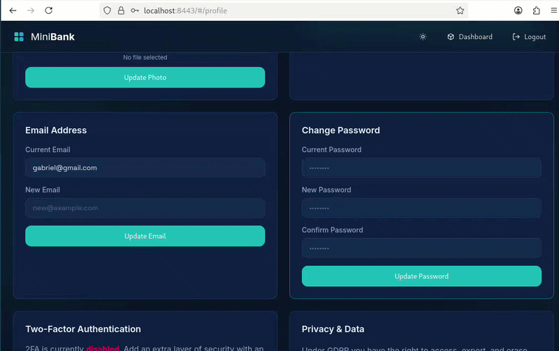

*This project has been created as part of the 42 curriculum by gcosta-m, gabastos, fde-alen, sdavi-al.*

**Description**
The name of our project is "42 Bank", but it's not a normal bank, it's a bank with a blockchain. Our goal is store money in a security wallet and transfering the money with anonimity to anyone in anywhere of the World. To do that, we have constructed a website with microservices, building a robust system of security and a clear/useful site for the users. The users can create account, change their personal datas, exclude their accounts, activate 2FA and the main goal: keep money and transfering with security/anonimity.

**Instructions**
As our project works with microservices, we have choosed to use the Docker/Docker Compose to take all images that we needed, so we need to install manually in our host machine the latest stable version of Docker and Docker Compose. Then to run the all program, we have to do:
` ` `
docker compose build
` ` `
The docker compose build command builds or rebuilds the images for the services defined in the docker-compose.yml file. It reads the instructions from each service's Dockerfile and prepares the images locally, without starting any containers.

` ` ` 
docker compose up
` ` `
The docker compose up command builds (if necessary), pulls images, creates containers, sets up networks and volumes, and starts all services defined in the docker-compose.yml file

Now our project is running on this address:
https://localhost:8443

The video below show the pages of login,register and dashboard:

Now the video that show how to change the user's personal datas:

Here our program show the function of 2FA and the GDPR in action, that the user can require their datas that are used by our program and exclude their account with their datas:

**Resources**
Throughout the project, we used AI assistance in our development process. It helped us understand what was needed to achieve our goals, troubleshoot errors, and get suggestions to improve code quality. We used the IA to help us to build the blockchain, the monitoring part and the frontend (pages).

The project includes documentation for the main features and technologies used. Most documents follow a clear "why/how" format to make technical decisions and implementation easier to understand.

- A brief backend document:
[backend](docs/BACKEND.md)

- A frontend document:
[frontend](docs/FRONTEND.md)

- NGINX documentation (gateway, routing, and security):
[nginx](docs/NGINX.md)

- Vault documentation (secrets and credential management):
[vault](docs/VAULT.md)

- 2FA documentation:
[2fa](docs/2FA.md)

- Blockchain documentation:
[blockchain](docs/BLOCKCHAIN.md)

- Database documentation:
[database](docs/DATABASE.md)

- Docker documentation:
[docker](docs/DOCKER.md)

- ELK documentation:
[elk](docs/ELK.md)

- GDPR documentation:
[gdpr](docs/GDPR.md)

- Microservices documentation:
[microservices](docs/MICROSERVICES.md)

- Monitoring documentation:
[monitoring](docs/MONITORING.MD)

- User Management documentation:
[user-management](docs/USER_MANAGEMENT.md)

***Team Information***
<gcosta-m> Gabriel Costa - Tech Lead: Defined the goal of our project and what stacks/technologies we have used, also defined the architecture of the program and review all code, refactoring what it was needed.

<gabastos> Gabriel Sobral - Product Owner: He defined the product vision, prioritized features based on project goals and user needs, and coordinated communication throughout the project lifecycle. He maintained alignment across the team, validated deliverables, and supported quality assurance by testing key features developed by other team members.

<fde-alen> Felippe de Alencar - Product Manager: He managed project planning and progress tracking across communication platforms, ensured blockers were identified and removed, and coordinated delivery timelines for each feature to keep the team aligned and on schedule.

<sdavi-al> Steffano Davi - Developer: He developed the features asked for the other team members, also tested the features and communicate the team what was function.

***Project Management***
The team’s tasks were organized to match each member’s skills and interests across the project modules. Meetings and discussions were held both in person at the 42 São Paulo campus and remotely through WhatsApp. For team management, in addition to WhatsApp, we also used Notion to plan the project and track tasks that were pending or completed. The entire project was initially built and version-controlled on GitHub.

***Technical Stack***

- Frontend technologies and frameworks: The frontend is an SPA built with Vanilla JavaScript (ES modules), HTML, and custom CSS.
[frontend](docs/FRONTEND.md)

- Backend technologies and frameworks: The backend is based on Node.js microservices using Express.js for APIs, with service-to-service communication over internal HTTP routes.
[backend](docs/BACKEND.md)

- Database system and why it was chosen: PostgreSQL was chosen for its strong relational model, ACID guarantees, and clear support for foreign keys, constraints, and indexed queries required by user/account/privacy flows.
[database](docs/DATABASE.md)

- Other significant technologies/libraries: Docker and Docker Compose (deployment/orchestration), NGINX + ModSecurity (gateway and security), Vault (secrets), JWT + bcrypt + TOTP (authentication security), Prometheus + Grafana (monitoring), ELK stack (centralized logging), and blockchain integration tooling. Documents further up.

- Justification for major technical choices: We prioritized modularity, security, and observability. Microservices improve separation of concerns, Docker ensures reproducible environments, PostgreSQL enforces data integrity, and dedicated monitoring/logging/security components improve reliability and operational control.

***Database Schema***
The document of database explain why we developed him on this schema, you can see more here:
[database](docs/DATABASE.md)

Our schema used:

` ` `
CREATE TABLE IF NOT EXISTS user_auth (
    id SERIAL PRIMARY KEY,
    email VARCHAR(255) UNIQUE NOT NULL,
    password_hash VARCHAR(255) NOT NULL,
    name VARCHAR(255) NOT NULL,
    created_at TIMESTAMP DEFAULT CURRENT_TIMESTAMP
);

ALTER TABLE user_auth ADD COLUMN IF NOT EXISTS totp_secret VARCHAR(255);
ALTER TABLE user_auth ADD COLUMN IF NOT EXISTS totp_enabled BOOLEAN NOT NULL DEFAULT FALSE;

CREATE INDEX IF NOT EXISTS idx_user_auth_email ON user_auth(email);

CREATE TABLE IF NOT EXISTS user_profiles (
    id SERIAL PRIMARY KEY,
    auth_user_id INTEGER REFERENCES user_auth(id) ON DELETE CASCADE,
    name VARCHAR(255) NOT NULL,
    profile_picture TEXT,
    wallet_address VARCHAR(255) UNIQUE,
    created_at TIMESTAMP DEFAULT CURRENT_TIMESTAMP,
    updated_at TIMESTAMP DEFAULT CURRENT_TIMESTAMP
);

CREATE INDEX IF NOT EXISTS idx_user_profiles_auth_user_id ON user_profiles(auth_user_id);
CREATE INDEX IF NOT EXISTS idx_user_profiles_wallet_address ON user_profiles(wallet_address);

CREATE TABLE IF NOT EXISTS gdpr_delete_requests (
    id SERIAL PRIMARY KEY,
    auth_user_id INTEGER REFERENCES user_auth(id) ON DELETE CASCADE,
    token VARCHAR(255) UNIQUE NOT NULL,
    created_at TIMESTAMP DEFAULT CURRENT_TIMESTAMP,
    expires_at TIMESTAMP NOT NULL
);

CREATE INDEX IF NOT EXISTS idx_gdpr_token ON gdpr_delete_requests(token);
` ` `

***Features List***

- **Frontend**
Brief summary: SPA interface with navigation, authentication flows, dashboard, profile, and GDPR pages.
Team member(s): `sdavi-al`

- **Backend API**
Brief summary: Core HTTP services for auth, user, transaction, and blockchain integration.
Team member(s): `gabastos`, `gcosta-m`

- **Microservices Architecture**
Brief summary: Domain split into independent services with internal API communication and clear responsibilities.
Team member(s): `gabastos`, `gcosta-m`

- **User Management**
Brief summary: Registration, login, profile lifecycle, account operations, and user-related routes.
Team member(s): `gabastos`, `sdavi-al`

- **2FA**
Brief summary: TOTP-based second factor with setup, verification, login challenge, and disable flow.
Team member(s): `gabastos`

- **NGINX Gateway and Security**
Brief summary: Entry gateway with HTTPS termination, routing, security headers, and request protection.
Team member(s): `gcosta-m`

- **Vault and Secrets Management**
Brief summary: Centralized runtime secret loading for credentials, tokens, and service configs.
Team member(s): `gabastos`, `gcosta-m`

- **Database Schema**
Brief summary: Relational model for identity/profile/privacy data with FK integrity and indexed lookups.
Team member(s): `gcosta-m`

- **Blockchain Module**
Brief summary: Wallet and transfer operations with immutable chain-side transaction references.
Team member(s): `gcosta-m`

- **Monitoring**
Brief summary: Metrics collection, health visibility, dashboards, and alerting support.
Team member(s): `fde-alen`

- **ELK Logging**
Brief summary: Centralized log collection, processing, indexing, and visual analysis.
Team member(s): `fde-alen`

- **Docker Deployment**
Brief summary: Containerized multi-service orchestration with reproducible local environment.
Team member(s): `gcosta-m`, `gabastos`, `fde-alen`

- **GDPR Features**
Brief summary: Data export and account deletion request/confirmation lifecycle.
Team member(s): `fde-alen`

***Modules***
-Minor: Framework backend (+1)
-Major: A public API to interact with the database with a secured API key, rate
limiting, documentation, and at least 5 endpoints. (+2)
-Minor: A complete notification system for all creation, update, and deletion actions. (+1)
-Minor: Support for additional browsers. (+1)
-Major: Standard user management and authentication (+2)
-Minor: Implement a complete 2FA (Two-Factor Authentication) system for the
users. (+1)
-Major: Implement WAF/ModSecurity (hardened) + HashiCorp Vault for secrets (+2)
-Major: Infrastructure for log management using ELK (Elasticsearch, Logstash,
Kibana) (+2)
-Major: Monitoring system with Prometheus and Grafana. (+2)
-Major: Backend as microservices. (+2)
-Minor: GDPR compliance features. (+1)
-Major: Store transactions on the Blockchain. (+2)

Total of 19 points.

### Module Details (Justification, Implementation, and Team Members)

#### 1) Framework backend (+1)
- Justification: Establish a complete web architecture with clear backend structure and maintainability.
- Implementation: Node.js backend with Express-based services and PostgreSQL integration behind NGINX.
- Team member(s): `gcosta-m`, `gabastos`.

#### 2) Public API with security, rate limiting, docs, and 5+ endpoints (+2)
- Justification: Provide a clear external interface for data operations while protecting service stability.
- Implementation: REST endpoints across auth/user/transaction/blockchain services, NGINX rate-limiting rules, and technical documentation under `docs/`.
- Team member(s): `gabastos`, `gcosta-m`.

#### 3) Notification system for create/update/delete actions (+1)
- Justification: Improve user feedback and traceability for critical account and data lifecycle actions.
- Implementation: Frontend notifications plus backend-triggered flows (including GDPR confirmation and status responses).
- Team member(s): `sdavi-al`, `gabastos`.

#### 4) Support for additional browsers (+1)
- Justification: Ensure usability and evaluation readiness across standard modern browser environments.
- Implementation: Standards-based HTML/CSS/JavaScript SPA tested with latest stable Chrome and compatible browser behaviors.
- Team member(s): `sdavi-al`.

#### 5) Standard user management and authentication (+2)
- Justification: User identity and access control are required foundations for all protected features.
- Implementation: Register/login endpoints, bcrypt password hashing, JWT auth flow, and profile/account operations.
- Team member(s): `gabastos`, `sdavi-al`.

#### 6) Complete 2FA (Two-Factor Authentication) system (+1)
- Justification: Add a stronger authentication layer for account protection and cybersecurity maturity.
- Implementation: TOTP setup, verification, login challenge, and disable flow integrated in backend and frontend.
- Team member(s): `gabastos`.

#### 7) WAF/ModSecurity (hardened) + Vault for secrets (+2)
- Justification (Custom module of choice): Reduce attack surface and centralize secret management with secure runtime access.
- Implementation: NGINX + ModSecurity ruleset with hardened policies/exclusions and Vault AppRole-based secret retrieval in services.
- Team member(s): `gcosta-m`, `gabastos`.

#### 8) ELK infrastructure for log management (+2)
- Justification (Custom module of choice): Centralized logging is essential for troubleshooting and operations in distributed systems.
- Implementation: Log shipping/processing/indexing/visualization pipeline using ELK components integrated in the stack.
- Team member(s): `fde-alen`.

#### 9) Monitoring with Prometheus and Grafana (+2)
- Justification (Custom module of choice): Provide measurable observability, health tracking, and service-level visibility.
- Implementation: Metrics scraping with Prometheus, dashboards in Grafana, and alerting support configuration.
- Team member(s): `fde-alen`.

#### 10) Backend as microservices (+2)
- Justification (Custom module of choice): Improve separation of concerns, scaling, and team parallel development.
- Implementation: Independent services (`auth_service`, `user_service`, `transaction_service`, `blockchain_service`) communicating over internal APIs.
- Team member(s): `gabastos`, `gcosta-m`.

#### 11) GDPR compliance features (+1)
- Justification: Provide privacy-aware data lifecycle controls and align the product with data protection expectations.
- Implementation: Export and deletion request/confirmation flow, with GDPR persistence (`gdpr_delete_requests`) and expiry handling.
- Team member(s): `fde-alen`.

#### 12) Store transactions on the Blockchain (+2)
- Justification (Custom module of choice): Guarantee immutable transaction references and support the project's blockchain objective.
- Implementation: Smart contract integration through the blockchain service with wallet/transfer operations linked to user flows.
- Team member(s): `gcosta-m`.

***Individual Contributions***
`gcosta-m` led the technical architecture of the project, including microservices design, database structure, cybersecurity hardening decisions, and blockchain integration direction. He also contributed to complex bug fixing, performance-oriented refactors, and code review of critical backend and infrastructure changes.
`gabastos` focused on backend feature delivery across microservices, with direct contributions to user management flows, 2FA implementation, and security-related integrations. He also worked on system notifications, endpoint behavior, bug resolution, and service-to-service API alignment.
`fde-alen` contributed to the DevOps and compliance layers, including monitoring setup, GDPR-related features, and centralized logging analysis. He supported cybersecurity tasks, observability improvements, and troubleshooting efforts to stabilize the platform during integration.
`sdavi-al` was responsible for the full frontend implementation, including page structure, user interaction flows, and UI consistency across the application. He also contributed to user management interfaces, browser compatibility adjustments, and fixes to keep the user experience stable and cohesive.
